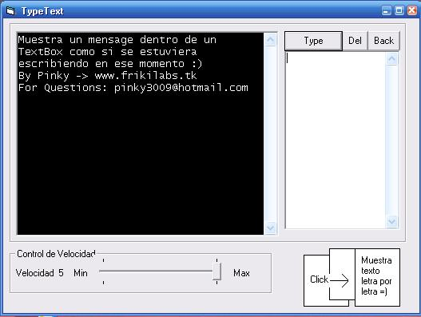

<div align="center">

## TypeMachine


</div>

### Description

This program can Show text inside a TextBox char by char, like it was written in this moment while it play a litle sound, it can create a cool effect!
 
### More Info
 
The parameter for the principal function (called TypeMsg) are a mensage string to be show and a number of secods to bee used as parameter in other function used to delay for X secods to delay the execution of sub procedures and functions.

Then, it show the text putting it chat by char and playing a sound.

It can crate an effect like a typemachine


<span>             |<span>
---                |---
**Submitted On**   |2005-06-28 23:06:52
**By**             |[Oliver Kraft](https://github.com/Planet-Source-Code/PSCIndex/blob/master/ByAuthor/oliver-kraft.md)
**Level**          |Beginner
**User Rating**    |5.0 (10 globes from 2 users)
**Compatibility**  |VB 6\.0
**Category**       |[String Manipulation](https://github.com/Planet-Source-Code/PSCIndex/blob/master/ByCategory/string-manipulation__1-5.md)
**World**          |[Visual Basic](https://github.com/Planet-Source-Code/PSCIndex/blob/master/ByWorld/visual-basic.md)
**Archive File**   |[TypeMachin1907156292005\.zip](https://github.com/Planet-Source-Code/oliver-kraft-typemachine__1-61406/archive/master.zip)

### API Declarations

```
Declare Function sndplaysound Lib "winmm.dll" Alias "sndPlaySoundA" (ByVal lpszSoundName As String, ByVal uFlags As Long) As Long
Declare Function sndStopSound Lib "winmm.dll" Alias "sndPlaySoundA" (ByVal lpszSoundName As Long, ByVal uFlags As Long) As Long
They are used to Play a sound.
```


